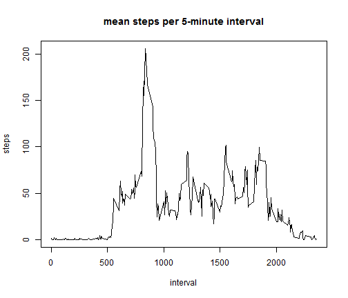

# Reproducible Research: Peer Assessment 1


## Loading and preprocessing the data
1. Read in the activity data.
2. Convert the "date" column into the Date class.

```r
mydata <- read.csv("~/R/Coursera/Reproducible-Research/data/repdata-data-activity/activity.csv", 
    stringsAsFactors = F)
mydata$date <- as.Date(mydata$date, "%Y-%m-%d")
```


## What is mean total number of steps taken per day?
Tally up the steps taken each day.

```r
step_sum <- aggregate(steps ~ date, data = mydata, sum)
```


Create a histogram of the total steps per day.

```r
hist(step_sum$steps, breaks = 10)
```

 


The mean number of total steps per day is:

```r
step_sum_mean <- mean(step_sum$steps)
print(step_sum_mean)
```

```
## [1] 10766
```


The median number of total steps per day is:

```r
step_sum_median <- median(step_sum$steps)
print(step_sum_median)
```

```
## [1] 10765
```


## What is the average daily activity pattern?
Average the number of steps for each 5 minute interval across all days.

```r
interval_steps <- aggregate(steps ~ interval, data = mydata, mean)
```


Plot the data.

```r
plot(interval_steps$interval, interval_steps$steps, type = "l")
```

 


The interval with the highest number of steps on average is:

```r
interval_steps[interval_steps$steps == max(interval_steps$steps), ]
```

```
##     interval steps
## 104      835 206.2
```


## Imputing missing values
The total number of missing values (missing steps per day/interval) is:

```r
sum(is.na(mydata$steps))
```

```
## [1] 2304
```


Impute all missing values by replacing "NA" with the mean number of steps for that specific 5 minute interval (mean across all days).

```r
# renaming a column due to merging two datasets, each with a column named
# 'steps'.
colnames(interval_steps)[2] <- "mean.int.steps"
impdata <- merge(mydata, interval_steps, by = "interval")
impdata <- impdata[order(impdata$date, impdata$interval), ]
head(impdata)
```

```
##     interval steps       date mean.int.steps
## 1          0    NA 2012-10-01        1.71698
## 63         5    NA 2012-10-01        0.33962
## 128       10    NA 2012-10-01        0.13208
## 205       15    NA 2012-10-01        0.15094
## 264       20    NA 2012-10-01        0.07547
## 327       25    NA 2012-10-01        2.09434
```

```r

impdata$steps[is.na(impdata$steps)] <- impdata$mean.int.steps
```

```
## Warning: number of items to replace is not a multiple of replacement
## length
```

```r
head(impdata)
```

```
##     interval   steps       date mean.int.steps
## 1          0 1.71698 2012-10-01        1.71698
## 63         5 0.33962 2012-10-01        0.33962
## 128       10 0.13208 2012-10-01        0.13208
## 205       15 0.15094 2012-10-01        0.15094
## 264       20 0.07547 2012-10-01        0.07547
## 327       25 2.09434 2012-10-01        2.09434
```


Tally up the steps taken each day (with imputed values).

```r
impstep_sum <- aggregate(steps ~ date, data = impdata, sum)
```


Create a histogram of the total steps per day (with imputed values).

```r
hist(impstep_sum$steps, breaks = 10)
```

 


The mean number of total steps per day (with imputed values):

```r
impstep_sum_mean <- mean(impstep_sum$steps)
print(impstep_sum_mean)
```

```
## [1] 10766
```


The median number of total steps per day is (with imputed values):

```r
impstep_sum_median <- median(impstep_sum$steps)
print(impstep_sum_median)
```

```
## [1] 10766
```


Imputing missing values changed the mean number of steps per day by:

```r
difmean <- impstep_sum_mean - step_sum_mean
print(difmean)
```

```
## [1] 0
```


Imputing missing values changed the median number of steps per day by:

```r
difmedian <- impstep_sum_median - step_sum_median
print(difmedian)
```

```
## [1] 1.189
```


## Are there differences in activity patterns between weekdays and weekends?

Add a weekday column to the data with imputed missing values.

```r
impdata$wkday <- weekdays(impdata$date)

# build a separate data.frame containing days of the week
wkday <- c("Sunday", "Monday", "Tuesday", "Wednesday", "Thursday", "Friday", 
    "Saturday")
daytype <- c("weekend", "weekday", "weekday", "weekday", "weekday", "weekday", 
    "weekend")
wk <- data.frame(wkday, daytype)
print(wk)
```

```
##       wkday daytype
## 1    Sunday weekend
## 2    Monday weekday
## 3   Tuesday weekday
## 4 Wednesday weekday
## 5  Thursday weekday
## 6    Friday weekday
## 7  Saturday weekend
```

```r

# now merge the wkday data.frame with the original data with imputed missing
# values.
impdata_wk <- merge(impdata, wk, by = "wkday", sort = F)
impdata_wk <- impdata_wk[order(impdata_wk$date, impdata_wk$interval), ]
```


Now average for each interval by weekend

```r
imp_interval_steps <- aggregate(steps ~ interval + daytype, data = impdata_wk, 
    mean)
```


Plot the data.

```r
library(lattice)
xyplot(steps ~ interval | daytype, data = imp_interval_steps, type = "l", layout = c(1, 
    2))
```

 

